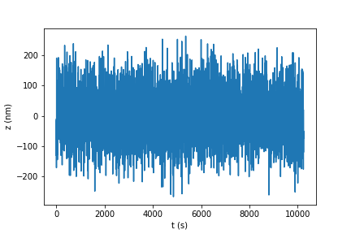
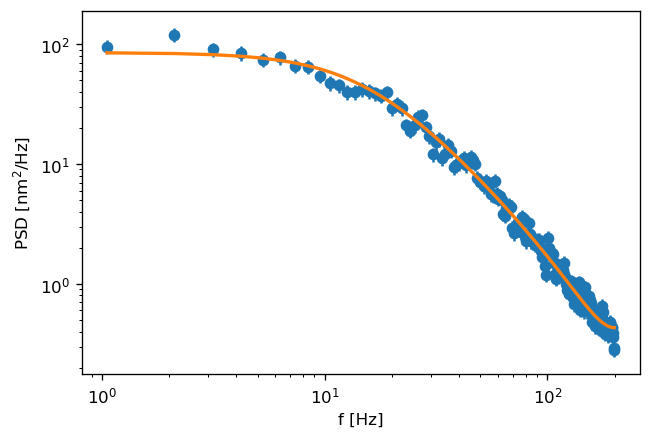
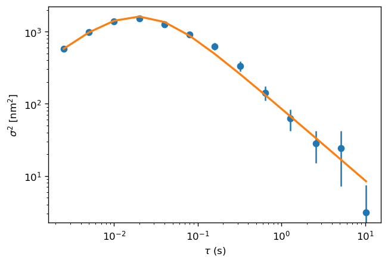

# tweezepy
This is [tweezepy](https://github.com/ianlmorgan/tweezepy), a package of single-molecule pulling experiment related analysis code.

# How to install
The simplest method of installing the `tweezepy` package is via the [Python Package Index](https://packaging.python.org/glossary/#term-python-package-index-pypi) (PyPI). To install from PyPI, you will need to be able to run python from the command line and make sure you have [pip](https://packaging.python.org/key_projects/#pip) available.

Install from PyPI:

    pip install tweezepy
An alternative method to install `tweezepy` is with setuptools.  Clone the repository onto a local machine, then navigate to the directory.

Using setuptools:
    
    cd path/to/tweezepy

    python setup.py install
    
# Contents
The `tweezepy` package includes the following modules:
* 'smmcalibration' - tool to determine force of probe trajectories by calculating and performing maximum likelihood estimation fits to power spectral density and allan variance
* 'simulations' - tool to simulate single-molecule probe trajectories

# Example use:
Simulate data:
```python
>>> import matplotlib.pyplot as plt
>>> from tweezepy.simulations import downsampled_trace
>>> alpha,kappa,fsample,N = 1e-5,.001,400,10240
>>> xtrace = downsampled_trace(alpha,kappa,fsample,N)
>>> plt.plot(xtrace)
>>> plt.show()
```


Power spectral density:
```python
>>> from tweezepy.smmcalibration import PSD
>>> psd = PSD(xtrace,fsample)
>>> pars,errs,covs = psd.mlefit()
>>> psd.plot()
```



Allan variance:
```python
>>> from tweezepy.smmcalibration import AV
>>> av = AV(xtrace,fsample)
>>> pars,errs,covs = av.mlefit()
>>> av.plot()
```


